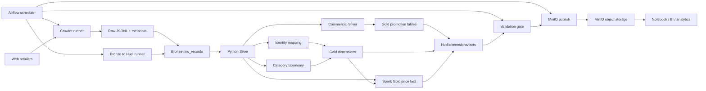

# Supermarket Promotion Data Pipeline

Pipeline thu thập dữ liệu giá và khuyến mãi từ nhiều chuỗi siêu thị, chuẩn hóa dữ liệu thành lakehouse để phục vụ so sánh giá, phân tích khuyến mãi và xây dựng các ứng dụng dữ liệu.

Các nguồn hiện tại:

```text
Bach Hoa Xanh | GO! | Lotte Mart | MM Mega Market | WinMart
```

## Mục lục

- [Mục tiêu dự án](#1-mục-tiêu-dự-án)
- [Kiến trúc hệ thống](#2-kiến-trúc-hệ-thống)
- [Mô hình dữ liệu](#3-mô-hình-dữ-liệu)
- [Cấu trúc thư mục](#4-cấu-trúc-thư-mục)
- [Cài đặt](#5-cài-đặt)
- [Cách chạy](#6-cách-chạy)
- [Validate](#7-validate)
- [Publish lên MinIO](#8-publish-lên-minio)
- [Airflow hằng ngày](#9-airflow-hằng-ngày)
- [CI/CD GitHub](#10-cicd-github)
- [Demo output](#11-demo-hình-ảnh-project)
- [Giới hạn hiện tại](#12-giới-hạn-hiện-tại)
- [Tài liệu chi tiết](#13-tài-liệu-chi-tiết)
- [Trạng thái project](#14-trạng-thái-project)

## 1. Mục tiêu dự án

Pipeline hỗ trợ các câu hỏi nghiệp vụ:

- Cùng một sản phẩm có giá bao nhiêu tại các retailer?
- Giá niêm yết, giá khuyến mãi và phần trăm giảm giá là bao nhiêu?
- Sản phẩm nào có thể so sánh trực tiếp giữa các retailer?
- Retailer nào đang có offer tốt hơn tại thời điểm quan sát?
- Một bản ghi có thể truy vết ngược về website, raw file và run crawl nào?

Phiên bản hiện tại ưu tiên dữ liệu product-level price/promotion theo ngày. Campaign ID, quy tắc mua X tặng Y và store master chính thức chưa đồng nhất giữa các nguồn.

## 2. Kiến trúc hệ thống



Luồng vận hành:

```text
Crawl
  -> Raw run
  -> Bronze ingest
  -> Python Silver
  -> Commercial Silver
  -> Product identity + category mapping
  -> Gold dimensions/facts
  -> Spark/Hudi validation
  -> MinIO publish
```

Airflow là **control plane**: lập lịch, chạy song song crawler, retry, quan sát log và chỉ gọi publish sau validation. Crawler, Python jobs, Spark, Hudi và MinIO là **data plane**: các thành phần thực sự đọc, xử lý và lưu dữ liệu.

### Phạm vi crawler

- Mỗi đợt crawl tạo một `run_id` dùng chung.
- Metadata của từng retailer nằm tại `raw/store=<retailer>/date=<date>/run_id=<run_id>/metadata.json`.
- Dùng `--skip-crawlers` để chạy lại pipeline từ raw run mà không truy cập website.
- WinMart có flow riêng `config_api -> promo_cards -> hydrate -> merge`, nhưng được gọi bởi runner chung.

### Các tầng dữ liệu

| Tầng | Nội dung | Mục đích |
|---|---|---|
| Raw | JSONL gốc, payload, metadata crawler | Bảo toàn bằng chứng từ source |
| Bronze | Raw record envelope, lineage, warnings, quarantine | Ingest idempotent và audit |
| Silver | Schema chuẩn hóa theo retailer | Chuẩn hóa field, giá, UOM, package, promotion |
| Gold | Dimension và fact phục vụ phân tích | Grain và foreign key rõ ràng |
| Hudi | Table format và commit history | Upsert, timeline, logical snapshot |
| MinIO | Object storage | Chia sẻ Hudi output cho máy khác |

Bronze giữ raw evidence và lineage, không tự thay đổi ngữ nghĩa dữ liệu. Silver chuẩn hóa schema giữa các retailer. Gold tạo các bảng phục vụ phân tích. Hudi quản lý record key, upsert và timeline; MinIO chỉ lưu object, không tự xử lý upsert.

## 3. Mô hình dữ liệu

### Silver

| Bảng | Grain | Vai trò |
|---|---|---|
| `retailer_products` | 1 retailer listing | Tên, brand, category, barcode, UOM, package, source URL, image URL |
| `product_observations` | 1 listing + store + ngày/thời điểm | Giá, discount, availability, promotion flags, lineage |
| `promotions` | 1 product-level offer theo ngày | Chuẩn hóa offer và promotion state, không giả mạo campaign ID |
| `promotion_items` | 1 sản phẩm trong 1 offer | Nối product listing với promotion |
| `product_identity_mapping` | 1 retailer listing mapping | Mapping sang `canonical_product_id` khi đủ bằng chứng |
| `category_taxonomy` | 1 source category mapping | Canonical category và trạng thái review |

Hai ID cần phân biệt:

```text
retailer_product_id   = listing của một retailer
canonical_product_id  = sản phẩm chuẩn dùng để match liên retailer
```

Mapping ưu tiên barcode/GTIN có checksum hợp lệ. Khi không có barcode, hệ thống chỉ match bằng attribute khi brand, product type, package quantity, unit, variant và pack count phù hợp. Record không đủ tin cậy giữ ở trạng thái `unmatched`.

### Gold và Hudi

| Bảng | Grain | Record key | Partition |
|---|---|---|---|
| `dim_retailer` | 1 retailer | `retailer_key` | none |
| `dim_date` | 1 ngày | `date_key` | `year` |
| `dim_store` | 1 store context | `store_key` | `retailer_id` |
| `dim_retailer_product` | 1 retailer listing | `retailer_product_key` | `retailer_id` |
| `dim_product` | 1 canonical product | `product_key` | none |
| `dim_promotion` | 1 product-level offer | `promotion_key` | `observation_date` |
| `fact_price_snapshot_daily` | 1 product + retailer + store + ngày | `price_snapshot_id` | `snapshot_date` |
| `fact_promotion_item` | 1 product trong promotion item | `promotion_item_fact_id` | `observation_date` |

Hudi sử dụng `COPY_ON_WRITE` và `append + upsert` cho các bảng persistent. Run mới tạo commit/partition mới; rerun cùng key cập nhật record thay vì tạo duplicate logic.

## 4. Cấu trúc thư mục

```text
supermarket/
|-- scrapers/                 # Crawler theo retailer
|-- jobs/
|   |-- bronze/               # Raw ingest
|   |-- silver/               # Normalize, mapping, taxonomy, commercial entities
|   |-- gold/                 # Gold JSONL dimensions/promotion tables
|   `-- spark/                # Spark Gold, Hudi writer, validators
|-- configs/                  # Crawler config và data contracts
|-- validation/               # Quality rules
|-- warehouse/                # Raw pipeline output Bronze/Silver/Gold JSONL
|-- warehouse_spark_docker/   # Persistent local Hudi/Parquet output
|-- notebooks/                # Manual validation notebooks
|-- scripts/                  # Runner và MinIO publish scripts
|-- infra/airflow/            # Airflow Docker, DAG hằng ngày
|-- infra/spark/              # Docker Spark image và compose
`-- docs/                     # Runbook, catalog, learning notes, changelog
```

## 5. Cài đặt

```bash
python -m venv .venv
source .venv/bin/activate
python -m pip install -r requirements.txt
python -m playwright install chromium
```

Khi chạy Spark/Hudi qua Docker, cần Docker Compose và quyền pull Spark/Hudi dependencies.

## 6. Cách chạy

### Full pipeline, có crawl dữ liệu mới

```bash
.venv/bin/python jobs/run_multi_retailer_pipeline.py \
  --retailers bachhoaxanh go lottemart mmvietnam \
  --include-winmart \
  --spark-output-format hudi
```

Thêm `--continue-on-error` nếu muốn retailer khác tiếp tục khi một retailer lỗi.

### Rerun không crawl

```bash
.venv/bin/python jobs/run_multi_retailer_pipeline.py \
  --retailers bachhoaxanh go lottemart mmvietnam \
  --include-winmart \
  --run-id YYYYMMDD_HHMMSS \
  --run-date YYYY-MM-DD \
  --skip-crawlers \
  --spark-output-format hudi
```

### Smoke test crawler

```bash
.venv/bin/python jobs/run_multi_retailer_pipeline.py \
  --retailers go lottemart \
  --test-limit 1 \
  --continue-on-error \
  --spark-output-format parquet
```

### Chỉ chạy WinMart

```bash
.venv/bin/python scrapers/winmart/winmart_full_crawl.py \
  --config configs/winmart_categories.yaml
```

WinMart hiện dùng:

```text
region: Binh Dinh
storeCode: 1682
storeGroupCode: 1998
category scope: level 1
```

### Kiểm tra manifest

```bash
jq '{status, failures, failure_details, retailers_requested, retailers_completed, retailers_missing}' \
  warehouse/pipeline_runs/date=YYYY-MM-DD/run_id=YYYYMMDD_HHMMSS/manifest.json
```

Full run chỉ được coi là pass khi `status=success`, `failures=0`, `retailers_missing=[]` và `retailers_completed` đủ các retailer được yêu cầu.

## 7. Validate

Thứ tự validate:

1. Kiểm tra crawler `metadata.json`, raw record count và quarantine.
2. Kiểm tra Silver contract, null key, duplicate grain và package/UOM parsing.
3. Daily run kiểm tra Spark manifest và Hudi logical snapshot. Khi có Python Gold reference, so sánh thêm Spark/Hudi với reference và yêu cầu `replacement_ready=true`.
4. Đọc Hudi bằng Hudi reader để kiểm tra logical snapshot, không cộng trực tiếp tất cả Parquet files trong timeline.
5. Kiểm tra foreign key fact -> dimension và Hudi commit.

Công cụ hiện có:

```text
notebooks/bronze_validate.ipynb
notebooks/gold_validate.ipynb
notebooks/hudi_validate.ipynb
jobs/validate_silver_spark_parquet.py
jobs/validate_spark_gold_manifest.py
jobs/spark/validate_hudi_history_spark.py
```

## 8. Publish lên MinIO

```text
API:     http://127.0.0.1:9020
Console: http://127.0.0.1:9021
Bucket:  supermarket-lakehouse
```

Chỉ publish sau khi manifest pass:

```bash
docker start minio-local

bash scripts/publish_hudi_to_minio.sh \
  --run-date YYYY-MM-DD \
  --run-id YYYYMMDD_HHMMSS \
  --endpoint http://127.0.0.1:9020 \
  --bucket supermarket-lakehouse
```

Script sẽ kiểm tra manifest, mirror các thư mục `*_hudi` sang `gold/` và copy manifest vào `pipeline_runs/`. MinIO không tự hiểu upsert; Hudi quyết định trạng thái record, còn `mc mirror` chỉ đồng bộ object.

## 9. Airflow hằng ngày

Airflow chạy DAG `daily_supermarket_lakehouse` lúc `06:00` theo giờ Việt Nam: crawl từng retailer, build Hudi, validate Spark/Hudi và chỉ sau đó publish MinIO. Khởi tạo dịch vụ:

```bash
bash scripts/setup_airflow.sh
```

Web UI mặc định: `http://127.0.0.1:8088`. Chi tiết task, rerun cùng `run_id` và publish gate nằm trong file local `docs/pipeline/airflow_daily_orchestration.md`.

Trước một run local có publish, MinIO phải hoạt động:

```bash
docker start minio-local
curl --fail http://127.0.0.1:9020/minio/health/live
```

Khi task fail, mở Grid trên UI, điều tra task đỏ đầu tiên rồi chọn retry/clear đúng boundary. Không dùng `Mark Success` để bỏ qua validation hoặc publish fail. Hướng dẫn học/vận hành chi tiết hiện nằm ở file local `docs/learning/airflow_tu_co_ban_den_van_hanh_dag.md`.

## 10. CI/CD GitHub

Repository có các workflow sau trong `.github/workflows/`:

| Workflow | Trigger | Vai trò |
|---|---|---|
| `CI` | Pull request và push `master` | Unit test, compile Python, Docker Compose config, secret scan, dependency audit |
| `Build Pipeline Images` | Sau khi CI `master` pass hoặc manual | Build/push image Airflow và Spark lên GHCR theo tag immutable `sha-<commit>` |
| `Deploy Pipeline Host` | Manual + GitHub Environment approval | Deploy image SHA sang self-hosted runner của máy pipeline |
| `Spark Hudi Integration Fixture` | Manual | Chạy Spark-to-Hudi với fixture sanitize, không crawl/publish production |

GitHub không chứa raw crawl, warehouse, Hudi, MinIO data hoặc `.env`. Để bật CD, cần tạo branch protection cho `master`, GitHub Environment `pipeline-production`, biến `PIPELINE_DEPLOY_ROOT` và self-hosted runner label `supermarket-pipeline`. Runbook local: `docs/pipeline/github_cicd_setup_runbook.md`.

## 11. Demo hình ảnh project

### Output của một run

```text
warehouse/pipeline_runs/date=<date>/run_id=<run_id>/manifest.json
warehouse/bronze/raw_records/store=<retailer>/date=<date>/run_id=<run_id>/
warehouse/silver/store=<retailer>/date=<date>/run_id=<run_id>/
warehouse_spark_docker/gold/*_hudi/
```

Khi demo nên đối chiếu:

1. `run_id` trong raw metadata và pipeline manifest.
2. `source_run_id` trong Silver/Gold record.
3. Commit trong `.hoodie/timeline` và object tương ứng trên MinIO.

## 12. Giới hạn hiện tại

- Dữ liệu ưu tiên tập sản phẩm khuyến mãi, chưa phải full catalog của mỗi retailer.
- Store của các retailer online chưa phải store master đã xác minh; `unknown_store` chỉ là source context.
- Barcode có thể thiếu; identity mapping không tự động gộp các variant chỉ vì tên giống nhau.
- Campaign ID, thời hạn promotion chính thức và buy-X-get-Y chưa có đầy đủ.
- BHX có `sale_start_at` và `sale_end_at` trong raw cho một số sale slot, nhưng các field này chưa được propagate vào Silver promotion date.
- Airflow orchestration hiện chạy local bằng Docker `LocalExecutor`; chưa có alert tự động, backup metadata database hoặc service lifecycle quản lý MinIO chung với Airflow.
- Spark/Hudi hiện phù hợp cho local lakehouse và scale thử nghiệm; production serving layer vẫn cần hardening thêm.

## 13. Tài liệu chi tiết

Thư mục `docs/` hiện được giữ local và không nằm trong baseline GitHub. Các tài liệu vận hành chi tiết có sẵn sau khi clone workspace đầy đủ:

- `docs/pipeline/complete_hudi_pipeline.md`
- `docs/pipeline/minio_hudi_publish_runbook.md`
- `docs/pipeline/airflow_daily_orchestration.md`
- `docs/pipeline/dag_pipeline_reliability_risk_register.md`
- `docs/learning/airflow_tu_co_ban_den_van_hanh_dag.md`

## 14. Trạng thái project

Đã có:

```text
5 retailer crawlers
Bronze raw ingest + quarantine
Python Silver normalization
Product identity mapping
Category taxonomy candidate mapping
Gold dimensions và promotion facts
Spark Gold price fact
Persistent Hudi output
Hudi logical validation
MinIO publish script
Airflow daily DAG: crawl -> build -> validate -> publish
GitHub CI, GHCR image build, approved self-hosted deploy workflow
Spark-to-Hudi sanitized integration fixture
```

Đang mở rộng:

```text
Promotion campaign semantics
Buy-X-get-Y parsing
Store master và location resolution
Full historical backfill
Kích hoạt branch protection, GitHub Environment và self-hosted runner trên GitHub/host
Tích hợp webhook alert thực tế và backup retention/restore drill
BI/data product serving layer
```
